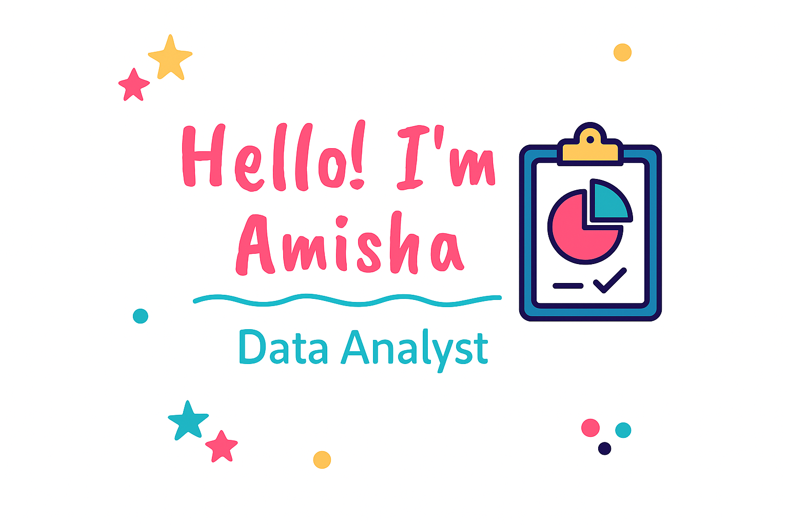

<!-- Banner -->

  

### Hi there 👋, I'm  Amisha Nakoti
#### | Data Analytics Enthusiast |
---
Curious mind with a love for turning data into stories 📊. Skilled in Power BI, Excel, SQL, and Python 💻, I enjoy creating dashboards that bring insights to life 📈. When I’m not exploring datasets, you’ll find me dancing 💃 or chasing the beauty of mountains 🏔️ and nature 🌿.

Skills: Power BI, Excel, SQL, Python, Data Visualization, Pandas, NumPy

- 🔭 I’m currently working on Data Analytics Projects  
- 🌱 I’m currently learning Pandas, NumPy, Data Visualization  
- 🤔 I’m looking for help with Real-world datasets 📂  
- 😄 Pronouns: She / Her  
- ⚡ Fun fact: Just like nature tells a story, I love finding the hidden rhythm in data 🌄📈💃  

- ## 🛠 Skills & Tools
<table>
<tr>
<td align="center">
   Excel
</td>
<td align="center">
   Power BI
</td>
<td align="center">
   MySQL
</td>
<td align="center">
   Python
</td>
<td align="center">
   NumPy
</td>
<td align="center">
   Pandas
</td>
<td align="center">
   Tableau
</td>
</tr>
</table>

## 📊 GitHub Analytics

  
  

## 🌐 Connect with Me
         
